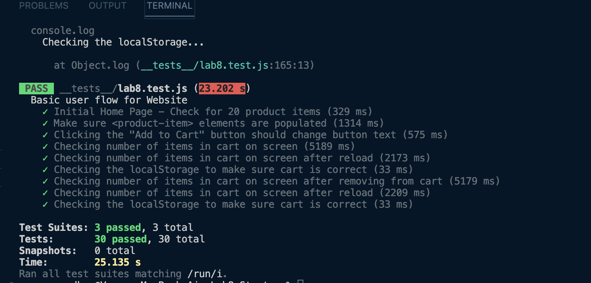

# Lab 8 - Starter

Partner: Varun Sreedhar

Question 1: Within a github action because it is before all of the code is done since you want to know when your code is broken
and its automatic so you won't forget to run it.

Question 2: No

Question 3: No because sending a message would be a function that requires a lot of steps and would be more of an end to end test rather than a unit test

Question 4: Yes you would use a unit test in this case because it is a unit that makes up the sending of the message

